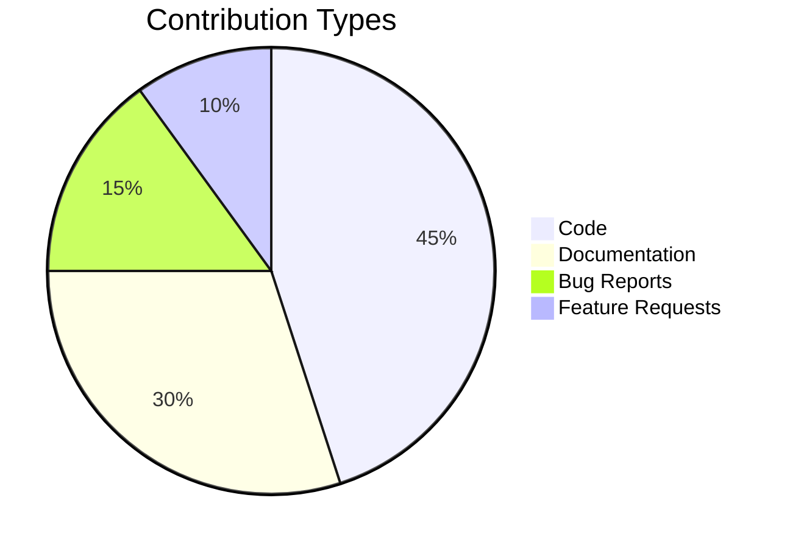

# Contributors ✨

## Thank You! 🎉

Thank you to all the amazing people who have contributed to this project! Whether it's through code, documentation, bug reports, or feature suggestions - every contribution matters!

## Project Team 👑

### Maintainers
- **Yaser I** - *Project Creator* - [@yessur3808](https://github.com/yessur3808)
  - 🔧 Core Architecture
  - 📚 Documentation
  - 👥 Community Management

<!-- ## Amazing Contributors 🌟

### Code Contributors

| Avatar | Name | GitHub | Contributions |
|--------|------|--------|---------------|
|  | Contributor Name | [@handle](https://github.com/handle) | Feature X, Bug Fixes |
|  | Another Dev | [@dev](https://github.com/dev) | Documentation |

### Feature Contributors 💡

These awesome people have contributed ideas and feature requests:

- [@user1](https://github.com/user1) - Suggested authentication improvement
- [@user2](https://github.com/user2) - Proposed UI enhancement

### Bug Hunters 🐛

Special thanks to these sharp-eyed contributors who helped identify and fix bugs:

- [@debugger1](https://github.com/debugger1)
- [@qatester](https://github.com/qatester)

### Documentation Heroes 📚

Thanks to these folks who helped make our docs awesome:

- [@docwriter](https://github.com/docwriter)
- [@translator](https://github.com/translator)

### Community Support 💪

These amazing people help maintain our community:

- [@moderator1](https://github.com/moderator1) - Forum Moderator
- [@helper2](https://github.com/helper2) - Discord Admin

## Hall of Fame 🏆

### Top Contributors This Month

1. [@superdev](https://github.com/superdev) - 15 PRs merged
2. [@bugslayer](https://github.com/bugslayer) - 10 bugs fixed
3. [@docninja](https://github.com/docninja) - Documentation overhaul -->

## How to Join This List 🤝

Want to see your name here? Here's how:

1. Check our [CONTRIBUTING.md](CONTRIBUTING.md) guide
2. Pick an issue or create one
3. Make your awesome contribution
4. Submit a Pull Request

## Contribution Stats 📊

## Special Thanks 💖
#### Additional thanks to:

- All our stargazers ⭐
- Everyone who's reported issues 🐛
- The amazing folks who've shared our project 📢
- Our patient beta testers 🧪

